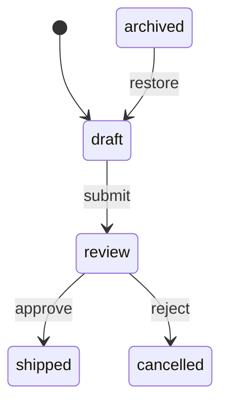

# State Machine Analysis

[State Machines](state-machines.md) covers defining, stepping,
introspecting, and embedding a `state-machine` as a pipeline stage. This
page picks up once a machine is built: analyzing it as a graph, replaying
event sequences, serializing and mutating its transition set, and bridging
it into the general graph toolkit.

## Analysis

A state machine is a labelled directed graph over states, and the analysis
layer treats it exactly that way — every result below is name-sorted and
computed purely from transition structure, ignoring guards. This section
uses an order-lifecycle machine with a dead-end `"cancelled"` state and an
unreachable `"archived"` state that nothing transitions into (adapted from
`examples/state-machine-visualization.lisp`):

```lisp
(defparameter *order-machine*
  (cl-dataflow:make-state-machine
    :state "draft"
    :transitions
    (list
      (cl-dataflow:make-transition "draft" "submit" "review")
      (cl-dataflow:make-transition "review" "approve" "shipped")
      (cl-dataflow:make-transition "review" "reject" "cancelled")
      (cl-dataflow:make-transition "archived" "restore" "draft"))))
```

`state-machine-states` and `state-machine-event-types` enumerate every
distinct state and event type the machine mentions (including the initial
and current state, even if no transition touches them):

```lisp
(cl-dataflow:state-machine-states *order-machine*)
;; => ("archived" "cancelled" "draft" "review" "shipped")
(cl-dataflow:state-machine-event-types *order-machine*)
;; => ("approve" "reject" "restore" "submit")
```

`state-machine-reachable-states` walks forward from a starting state (`:from`,
defaulting to the initial state; the start state itself is always included, and
an unknown `:from` yields `nil`). `state-machine-unreachable-states` is its
complement over all known states, always measured from the initial state — this
is how `"archived"` shows up as unreachable:

```lisp
(cl-dataflow:state-machine-reachable-states *order-machine*)
;; => ("cancelled" "draft" "review" "shipped")
(cl-dataflow:state-machine-unreachable-states *order-machine*)
;; => ("archived")
```

`state-machine-reachable-p` is the two-state yes/no form of the same walk,
comparing state names case-insensitively — so a known state is always reachable
from itself, and an unknown endpoint is never reachable:

```lisp
(cl-dataflow:state-machine-reachable-p *order-machine* "draft" "cancelled")
;; => T
(cl-dataflow:state-machine-reachable-p *order-machine* "draft" "archived")
;; => NIL
```

`state-machine-terminal-states` lists states with no outgoing transition
(dead ends — here, `"cancelled"` and `"shipped"`).
`state-machine-deterministic-p` checks whether any `(state, event-type)` pair
is shared by two or more transitions; this is purely structural and
guard-independent, so `nil` doesn't mean the machine is broken, only that
resolving that event requires a guard to pick among candidates:

```lisp
(cl-dataflow:state-machine-terminal-states *order-machine*)
;; => ("cancelled" "shipped")
(cl-dataflow:state-machine-deterministic-p *order-machine*)
;; => T
```

`state-machine->dot` and `state-machine->mermaid` render the machine (states
as nodes, transitions as event-labelled edges, a synthetic start marker into
the initial state) for diagrams — `write-state-machine-dot` and
`write-state-machine-mermaid` are the streaming counterparts that write
directly to a stream (and return the machine) instead of building a string.
Both DOT entry points take a `:name` for the generated digraph, defaulting to
`"S"`:

```lisp
(format t "~A" (cl-dataflow:state-machine->mermaid *order-machine*))
```



## Execution and interpretation

Where the analysis layer looks at structure, the execution layer interprets
event sequences with the runtime's exact guard/transition semantics. Each
helper below works over an internal `copy-state-machine`, so `*order-machine*`
is never mutated by any of them. `state-machine-run-states` and
`state-machine-accepts-p` also take a `:context`, handed to guards and actions
exactly as `step-state-machine` would.

`state-machine-run-states` replays a list of events and returns the visited
states, starting state included, stopping (without erroring) at the first
event that has no available or guard-passing transition:

```lisp
(cl-dataflow:state-machine-run-states *order-machine* '("submit" "approve"))
;; => ("draft" "review" "shipped")
(cl-dataflow:state-machine-run-states *order-machine* '("submit" "bogus-event"))
;; => ("draft" "review")
```

`state-machine-accepts-p` is the yes/no form: it returns true only when every
event in the sequence steps successfully and the machine lands in one of the
named `accepting` states:

```lisp
(cl-dataflow:state-machine-accepts-p
  *order-machine* '("submit" "approve") '("shipped"))
;; => T
```

`state-machine-event-path` is the event-level analog of `graph-path` (see
[Graph Algorithms](graph-algorithms.md)): a breadth-first search over
transitions (guards ignored) that returns the shortest list of event types
driving the machine from one state to another, the empty list when `from` and
`to` are the same known state, or `nil` when the target is unreachable (or
either endpoint is unknown):

```lisp
(cl-dataflow:state-machine-event-path *order-machine* "draft" "cancelled")
;; => ("submit" "reject")
```

## Builders: serialization, completeness, and mutation

`state-machine-to-plist` serializes a machine's state, initial state,
metadata, and transitions (`:from`/`:event-type`/`:to`/`:metadata`) to a
plist; `plist-to-state-machine` rebuilds a machine from one. Guards and
actions are runtime closures, so they are **not** serialized — nor are
`state-machine-history` and `state-machine-history-limit`. A round trip
preserves states, events, targets, and metadata, but reconstructed transitions
have no guard or action and the rebuilt machine starts with empty, unbounded
history:

```lisp
(cl-dataflow:plist-to-state-machine
  (cl-dataflow:state-machine-to-plist *order-machine*))
```

`state-machine-equal-p` compares two machines through exactly that plist, so it
is structural equality that deliberately ignores guards, actions, and history:

```lisp
(cl-dataflow:state-machine-equal-p
  *order-machine*
  (cl-dataflow:plist-to-state-machine
    (cl-dataflow:state-machine-to-plist *order-machine*)))
;; => T
```

`state-machine-complete-p` checks whether the transition relation is total —
every `(state, event-type)` pair drawn from `state-machine-states` and
`state-machine-event-types` has a defined transition. A machine with no
events is vacuously complete:

```lisp
(cl-dataflow:state-machine-complete-p *order-machine*)
;; => NIL  ; e.g. no transition from "draft" on "approve"
```

`state-machine-transition-for` looks up the first transition from a state on
an event type (guards ignored), returning an independent copy or `nil`:

```lisp
(cl-dataflow:state-machine-transition-for *order-machine* "review" "approve")
;; => #<STATE-TRANSITION review --approve--> shipped>
```

`add-transition` appends a new transition in place — taking the same
`:guard`/`:action`/`:metadata` keywords as `make-transition` — and returns the
machine; because guard selection picks the first matching transition, appended
transitions act as lower-priority fallbacks. `remove-transition` deletes
every transition matching a `(from, event-type, to)` triple, in place. Both
work directly on the machine object you pass, so here we mutate a copy to
leave `*order-machine*` itself untouched for the next section:

```lisp
(defparameter *order-machine-copy*
  (cl-dataflow:copy-state-machine *order-machine*))

(cl-dataflow:add-transition *order-machine-copy* "cancelled" "restore" "draft")
(cl-dataflow:remove-transition *order-machine-copy* "archived" "restore" "draft")
```

`state-machine-relabel-state` instead returns a **new** machine with a state
renamed everywhere it appears — current state, initial state, and every
transition endpoint — carrying guards, actions, and metadata over unchanged.
Like the plist round trip, it does not carry history over:

```lisp
(cl-dataflow:state-machine-relabel-state *order-machine* "shipped" "delivered")
;; states => ("archived" "cancelled" "delivered" "draft" "review")

(cl-dataflow:state-machine-states *order-machine*)
;; => ("archived" "cancelled" "draft" "review" "shipped")  ; original untouched
```

## Bridging to the graph toolkit

`state-machine->graph` turns a machine into a plain `graph`: one node per
state, and one edge per distinct `(from, to)` pair, with the first matching
transition's event type stored in the edge's metadata under `:event`.
Parallel transitions between the same pair of states collapse to a single
edge, and a self-transition becomes a self-loop. Once you have a `graph`, the
entire [graph-analysis toolkit](graph-algorithms.md) applies — cycles,
strongly connected components, distances, condensation, and more:

```lisp
(defparameter *order-graph* (cl-dataflow:state-machine->graph *order-machine*))

(cl-dataflow:graph-node-names *order-graph*)
;; => ("archived" "cancelled" "draft" "review" "shipped")
(cl-dataflow:graph-acyclic-p *order-graph*)
;; => T
```

## Errors

Stepping a machine can signal two conditions. `invalid-transition-error`
means no transition matches the current `(state, event-type)` pair at all;
`guard-failed-error` means at least one transition matched but every
candidate's guard rejected the event (and exposes the rejected transition via
`guard-failed-transition` for inspection). Both carry the offending
`state`/`event-type` (`invalid-transition-state`/`invalid-transition-event-type`
and `guard-failed-state`/`guard-failed-event-type`) plus a human-readable
`detail`. See [Public API Reference](api-reference.md) for the full reader
list and every other condition type in the library.

## See also

- [State Machines](state-machines.md) — defining, stepping, introspecting,
  and embedding a `state-machine`, which this page continues from.
- [Graph Algorithms](graph-algorithms.md) and
  [Graph Analysis](graph-analysis.md) — the general graph toolkit that
  `state-machine->graph` bridges into.
- [Public API Reference](api-reference.md) — the full alphabetized export
  list.
