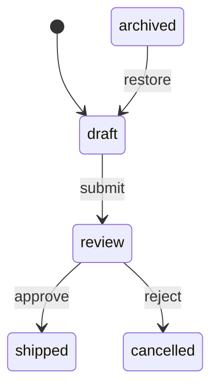

# State Machines

A `state-machine` is a small guarded transition model: a current state, an
initial state, an ordered list of `state-transition`s, a bounded history of
past transitions, and free-form metadata. `step-state-machine` is the reducer
at its core — feed it an event, get back the machine and a transition record —
and everything else on this page (introspection, analysis, serialization,
pipeline embedding) is built on top of that one operation.

## Defining a machine

`make-transition` builds a single `from event-type to` edge, with optional
`:guard`, `:action`, and `:metadata`:

```lisp
(cl-dataflow:make-transition "idle" "start" "running"
  :action (lambda (machine event context)
            (declare (ignore machine event context))
            (values "running" '(:note "entered running"))))
```

An action receives `(machine event context)` and may return two values: an
overriding next-state (used instead of the transition's `:to` when non-nil)
and an arbitrary result value that ends up in the transition record's
`:action-result`. A guard has the same argument list and must return true for
the transition to be selected; when several transitions share a `(state,
event-type)` pair, the first one whose guard passes wins, in definition
order.

`make-state-machine` assembles transitions into a machine. You must supply
`:state`, `:initial-state`, or both — if you give only `:state` it is also
used as the initial state, and vice versa:

```lisp
(defparameter *machine*
  (cl-dataflow:make-state-machine
    :state "idle"
    :transitions
    (list
      (cl-dataflow:make-transition
        "idle" "start" "running"
        :action (lambda (machine event context)
                  (declare (ignore machine event context))
                  (values "running" '(:note "entered running"))))
      (cl-dataflow:make-transition "running" "complete" "completed"))))
```

(Adapted from `examples/state-machine.lisp`.)

For a more declarative flavor, `define-state-machine` expands each `(from
event to &key guard action metadata)` clause into a `make-transition` call
and wraps the whole thing in `make-state-machine`:

```lisp
(defparameter *review-machine*
  (cl-dataflow:define-state-machine (:state "draft")
    ("draft" "submit" "review")
    ("review" "approve" "shipped")
    ("review" "reject" "cancelled")))
```

The definition-level options are `:state`, `:initial-state`, `:history`,
`:history-limit`, and `:metadata`; each transition clause accepts `:guard`,
`:action`, and `:metadata`. Both forms produce a plain `state-machine` value
— there is no special macro-only representation to unwrap.

## Stepping

`step-state-machine` is the reducer: given a machine, an event (a string,
symbol, or full `event` object), and an optional `:context`, it finds the
matching transition, runs its action, updates the machine's state in place,
and returns `(values machine transition-record)`:

```lisp
(cl-dataflow:step-state-machine
  (cl-dataflow:make-state-machine
    :state "idle"
    :transitions (list (cl-dataflow:make-transition "idle" "start" "running")))
  "start")
;; => #<STATE-MACHINE ...>, (:FROM "idle" :EVENT-TYPE "start" :TO "running"
;;                            :STATE-BEFORE "idle" :GUARD-PASSED T
;;                            :ACTION-RESULT NIL)
```

When you pass `:context`, stepping also updates `context-state` and appends a
copy of the transition record to `context-trace` — this is what "a state
machine behaves like a reducer inside pipeline and workflow code" (see
[Core Concepts](core-concepts.md)) means in practice. `run-state-machine`
drives a sequence of events through `step-state-machine`, returning
`(values machine transition-records)`. `run-state-machine-with-context` adds
context management: omit `:context` and it seeds a fresh one from the
machine's current state; either way it returns `(values machine
transition-records context)` with `context-state` synchronized to the final
state:

```lisp
(defparameter *context*
  (cl-dataflow:make-context :state (cl-dataflow:state-machine-state *machine*)))

(multiple-value-bind (updated-machine transition-records updated-context)
    (cl-dataflow:run-state-machine-with-context
      *machine* '("start" "complete") :context *context*)
  (declare (ignore updated-machine))
  (cl-dataflow:context-state updated-context))
;; => "completed"
```

(This is `examples/state-machine.lisp` end to end; `*machine*` itself is now
sitting in state `"completed"`, since `step-state-machine` mutates its
argument.) If a transition fails — no matching `(state, event-type)` pair, or
every candidate's guard rejects the event — `step-state-machine` signals
`invalid-transition-error` or `guard-failed-error` rather than silently
no-opping.

## Introspecting the control surface

`state-machine-available-transitions` lists every transition out of a state
— the current state by default, or any state via `:state`:

```lisp
(cl-dataflow:state-machine-available-transitions *review-machine*)
;; => (#<STATE-TRANSITION draft --submit--> review>)

(cl-dataflow:state-machine-available-transitions *review-machine* :state "review")
;; => (#<STATE-TRANSITION review --approve--> shipped>
;;     #<STATE-TRANSITION review --reject--> cancelled>)
```

`state-machine-can-step-p` preflights a single event without mutating
anything, and accepts `:context` so guards that inspect context data see the
same runtime state they would see during a real step:

```lisp
(cl-dataflow:state-machine-can-step-p *review-machine* "submit")
;; => T
(cl-dataflow:state-machine-can-step-p *review-machine* "bogus")
;; => NIL
```

## Lifecycle: copying, resetting, and history

`reset-state-machine` snaps a machine's current state back to its initial
state, in place — it only touches `state-machine-state`, so accumulated
`state-machine-history` survives a reset untouched:

```lisp
(cl-dataflow:reset-state-machine *machine*)
(cl-dataflow:state-machine-state *machine*)
;; => "idle"
(length (cl-dataflow:state-machine-history *machine*))
;; => 2  ; the "start" and "complete" records from run-state-machine-with-context
```

`copy-state-machine` clones a machine's transitions, history, and metadata
into an independent value, so you can fork a machine and let each copy evolve
on its own without touching the original:

```lisp
(defparameter *scratch* (cl-dataflow:copy-state-machine *machine*))
(cl-dataflow:step-state-machine *scratch* "start")
(cl-dataflow:state-machine-state *scratch*)
;; => "running"
(cl-dataflow:state-machine-state *machine*)
;; => "idle"  ; unaffected
```

`state-machine-history` returns the ordered list of transition records (most
recent first), bounded by `state-machine-history-limit` (`nil` means
unbounded; `0` disables history entirely). `state-machine-last-transition` is
a convenience reader for the most recent record, or `nil` if the machine has
never stepped:

```lisp
(cl-dataflow:state-machine-last-transition *machine*)
;; => (:FROM "running" :EVENT-TYPE "complete" :TO "completed"
;;     :STATE-BEFORE "running" :GUARD-PASSED T :ACTION-RESULT NIL)
```

## Embedding in pipelines

`make-state-machine-node` turns a state machine into an ordinary pipeline
stage (a `node`), so it can sit inside a `define-pipeline`/`define-workflow`
graph alongside any other stage. `:event-fn` computes the event to step with
from `(input context)` — it may return an event designator (string/symbol) or
a full `event` object; when omitted, the stage's input is used directly as
the event. `:result-fn` computes the stage's output from
`(updated-machine event input context)`; when omitted, the stage's output is
the machine's new state:

```lisp
(cl-dataflow:make-state-machine-node
  *machine*
  :name "order-transition"
  :event-fn (lambda (input context)
              (declare (ignore context))
              (getf input :event))
  :result-fn (lambda (updated-machine event input context)
               (declare (ignore event input context))
               (cl-dataflow:state-machine-state updated-machine)))
```

`examples/event-workflow.lisp` shows the complementary hand-rolled pattern —
a plain node handler that calls `emit-event` and `step-state-machine`
directly — which is exactly what `make-state-machine-node` packages up as a
reusable stage. See [Pipelines and Workflows](pipelines.md) for
`define-workflow`, which unifies graph edges, transitions, and machine nodes
in one macro expansion.

## Analysis

A state machine is a labelled directed graph over states, and the analysis
layer treats it exactly that way — every result below is name-sorted and
computed purely from transition structure, ignoring guards. This section
uses an order-lifecycle machine with a dead-end `"cancelled"` state and an
unreachable `"archived"` state that nothing transitions into (adapted from
`examples/state-machine-visualization.lisp`):

```lisp
(defparameter *order-machine*
  (cl-dataflow:make-state-machine
    :state "draft"
    :transitions
    (list
      (cl-dataflow:make-transition "draft" "submit" "review")
      (cl-dataflow:make-transition "review" "approve" "shipped")
      (cl-dataflow:make-transition "review" "reject" "cancelled")
      (cl-dataflow:make-transition "archived" "restore" "draft"))))
```

`state-machine-states` and `state-machine-event-types` enumerate every
distinct state and event type the machine mentions (including the initial
and current state, even if no transition touches them):

```lisp
(cl-dataflow:state-machine-states *order-machine*)
;; => ("archived" "cancelled" "draft" "review" "shipped")
(cl-dataflow:state-machine-event-types *order-machine*)
;; => ("approve" "reject" "restore" "submit")
```

`state-machine-reachable-states` walks forward from a starting state (the
initial state by default) and `state-machine-unreachable-states` is its
complement over all known states — this is how `"archived"` shows up as
unreachable:

```lisp
(cl-dataflow:state-machine-reachable-states *order-machine*)
;; => ("cancelled" "draft" "review" "shipped")
(cl-dataflow:state-machine-unreachable-states *order-machine*)
;; => ("archived")
```

`state-machine-terminal-states` lists states with no outgoing transition
(dead ends — here, `"cancelled"` and `"shipped"`).
`state-machine-deterministic-p` checks whether any `(state, event-type)` pair
is shared by two or more transitions; this is purely structural and
guard-independent, so `nil` doesn't mean the machine is broken, only that
resolving that event requires a guard to pick among candidates:

```lisp
(cl-dataflow:state-machine-terminal-states *order-machine*)
;; => ("cancelled" "shipped")
(cl-dataflow:state-machine-deterministic-p *order-machine*)
;; => T
```

`state-machine->dot` and `state-machine->mermaid` render the machine (states
as nodes, transitions as event-labelled edges, a synthetic start marker into
the initial state) for diagrams — `write-state-machine-dot` and
`write-state-machine-mermaid` are the streaming counterparts that write
directly to a stream instead of building a string:

```lisp
(format t "~A" (cl-dataflow:state-machine->mermaid *order-machine*))
```



## Execution and interpretation

Where the analysis layer looks at structure, the execution layer interprets
event sequences with the runtime's exact guard/transition semantics. Each
helper below works over an internal `copy-state-machine`, so `*order-machine*`
is never mutated by any of them.

`state-machine-run-states` replays a list of events and returns the visited
states, starting state included, stopping (without erroring) at the first
event that has no available or guard-passing transition:

```lisp
(cl-dataflow:state-machine-run-states *order-machine* '("submit" "approve"))
;; => ("draft" "review" "shipped")
(cl-dataflow:state-machine-run-states *order-machine* '("submit" "bogus-event"))
;; => ("draft" "review")
```

`state-machine-accepts-p` is the yes/no form: it returns true only when every
event in the sequence steps successfully and the machine lands in one of the
named `accepting` states:

```lisp
(cl-dataflow:state-machine-accepts-p
  *order-machine* '("submit" "approve") '("shipped"))
;; => T
```

`state-machine-event-path` is the event-level analog of `graph-path` (see
[Graph Algorithms](graph-algorithms.md)): a breadth-first search over
transitions (guards ignored) that returns the shortest list of event types
driving the machine from one state to another, or `nil` when the target is
unreachable:

```lisp
(cl-dataflow:state-machine-event-path *order-machine* "draft" "cancelled")
;; => ("submit" "reject")
```

## Builders: serialization, completeness, and mutation

`state-machine-to-plist` serializes a machine's state, initial state,
metadata, and transitions (`:from`/`:event-type`/`:to`/`:metadata`) to a
plist; `plist-to-state-machine` rebuilds a machine from one. Guards and
actions are runtime closures, so they are **not** serialized — a round trip
preserves states, events, targets, and metadata, but reconstructed
transitions have no guard or action:

```lisp
(cl-dataflow:plist-to-state-machine
  (cl-dataflow:state-machine-to-plist *order-machine*))
```

`state-machine-complete-p` checks whether the transition relation is total —
every `(state, event-type)` pair drawn from `state-machine-states` and
`state-machine-event-types` has a defined transition. A machine with no
events is vacuously complete:

```lisp
(cl-dataflow:state-machine-complete-p *order-machine*)
;; => NIL  ; e.g. no "shipped"/"approve"-from-"draft" transition
```

`state-machine-transition-for` looks up the first transition from a state on
an event type (guards ignored), returning an independent copy or `nil`:

```lisp
(cl-dataflow:state-machine-transition-for *order-machine* "review" "approve")
;; => #<STATE-TRANSITION review --approve--> shipped>
```

`add-transition` appends a new transition in place and returns the machine;
because guard selection picks the first matching transition, appended
transitions act as lower-priority fallbacks. `remove-transition` deletes
every transition matching a `(from, event-type, to)` triple, in place. Both
work directly on the machine object you pass, so here we mutate a copy to
leave `*order-machine*` itself untouched for the next section:

```lisp
(defparameter *order-machine-copy*
  (cl-dataflow:copy-state-machine *order-machine*))

(cl-dataflow:add-transition *order-machine-copy* "cancelled" "restore" "draft")
(cl-dataflow:remove-transition *order-machine-copy* "archived" "restore" "draft")
```

`state-machine-relabel-state` instead returns a **new** machine with a state
renamed everywhere it appears — current state, initial state, and every
transition endpoint — carrying guards and actions over unchanged:

```lisp
(cl-dataflow:state-machine-relabel-state *order-machine* "shipped" "delivered")
;; states => ("archived" "cancelled" "delivered" "draft" "review")

(cl-dataflow:state-machine-states *order-machine*)
;; => ("archived" "cancelled" "draft" "review" "shipped")  ; original untouched
```

## Bridging to the graph toolkit

`state-machine->graph` turns a machine into a plain `graph`: one node per
state, and one edge per distinct `(from, to)` pair, with the first matching
transition's event type stored in the edge's metadata under `:event`.
Parallel transitions between the same pair of states collapse to a single
edge, and a self-transition becomes a self-loop. Once you have a `graph`, the
entire [graph-analysis toolkit](graph-algorithms.md) applies — cycles,
strongly connected components, distances, condensation, and more:

```lisp
(defparameter *order-graph* (cl-dataflow:state-machine->graph *order-machine*))

(cl-dataflow:graph-node-names *order-graph*)
;; => ("archived" "cancelled" "draft" "review" "shipped")
(cl-dataflow:graph-acyclic-p *order-graph*)
;; => T
```

## Errors

Stepping a machine can signal two conditions. `invalid-transition-error`
means no transition matches the current `(state, event-type)` pair at all;
`guard-failed-error` means at least one transition matched but every
candidate's guard rejected the event (and exposes the rejected transition via
`guard-failed-transition` for inspection). Both carry the offending
`state`/`event-type` (`invalid-transition-state`/`invalid-transition-event-type`
and `guard-failed-state`/`guard-failed-event-type`) plus a human-readable
`detail`. See [Public API Reference](api-reference.md) for the full reader
list and every other condition type in the library.
